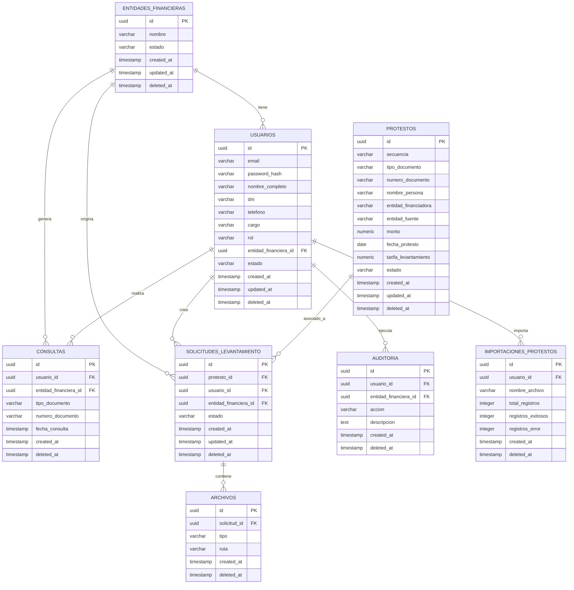
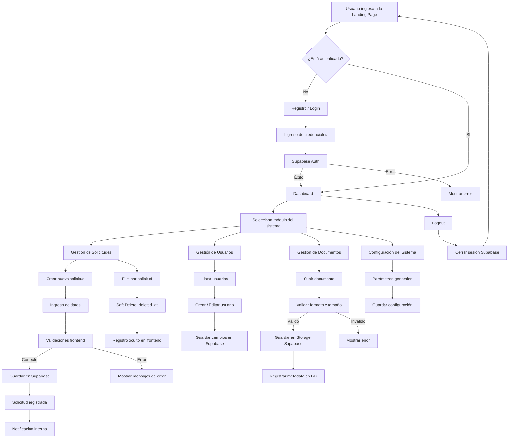
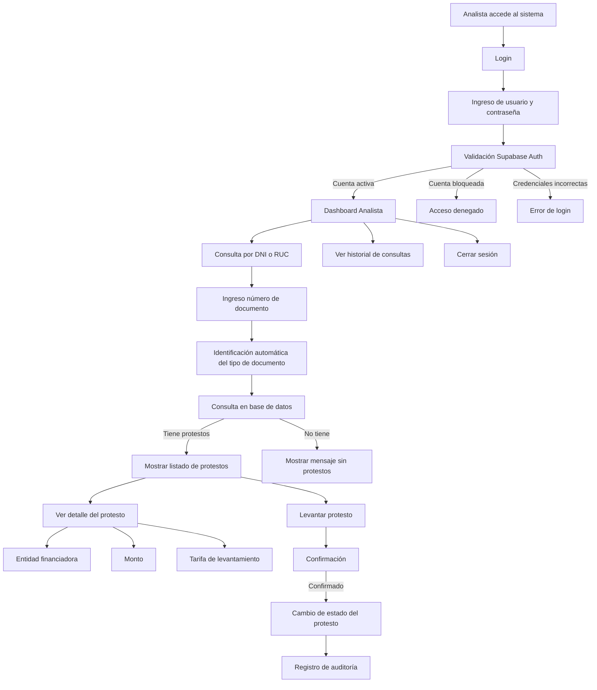
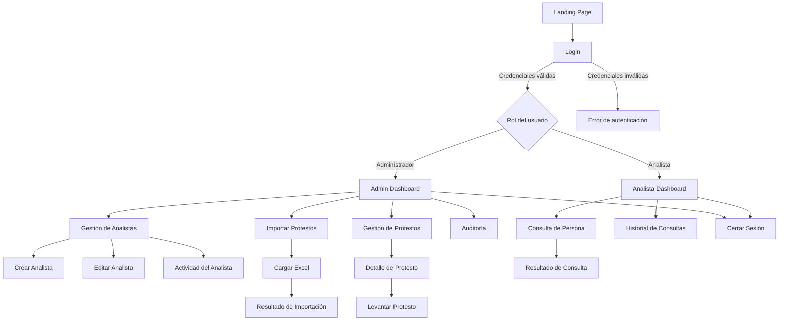

# Consultas Protestos

Diagrama E-R



Flujo de la Aplicacion

Administrador de la Camara





Flujo de navegacion



Estructura de Carpetas

```xml
src/
│
├── app/                    # Bootstrap de la app
│   ├── App.jsx
│   ├── Router.jsx
│   ├── ProtectedRoute.jsx
│   └── index.jsx
│
├── assets/                 # Recursos estáticos
│   ├── images/
│   ├── icons/
│   └── styles/
│       ├── globals.css
│       ├── variables.css
│       └── resets.css
│
├── components/             # Atomic Design
│   ├── atoms/
│   ├── molecules/
│   ├── organisms/
│   ├── templates/
│
├── pages/                  # Páginas (rutas)
│   ├── public/
│   │   ├── Landing.jsx
│   │   └── Login.jsx
│   │
│   ├── admin/
│   │   ├── Dashboard.jsx
│   │   ├── Analysts.jsx
│   │   ├── AnalystForm.jsx
│   │   ├── ImportProtests.jsx
│   │   ├── Protests.jsx
│   │   └── Audit.jsx
│   │
│   └── analyst/
│       ├── Dashboard.jsx
│       ├── Search.jsx
│       └── History.jsx
│
├── layouts/                # Layouts por rol
│   ├── PublicLayout.jsx
│   ├── AdminLayout.jsx
│   └── AnalystLayout.jsx
│
├── features/               # Lógica de negocio por dominio
│   ├── auth/
│   ├── users/
│   ├── protests/
│   ├── audit/
│   └── imports/
│
├── services/               # Integraciones externas
│   ├── supabase/
│   │   ├── client.js
│   │   ├── auth.service.js
│   │   ├── users.service.js
│   │   ├── protests.service.js
│   │   └── audit.service.js
│   └── storage.service.js
│
├── hooks/                  # Hooks reutilizables
│   ├── useAuth.js
│   ├── useRole.js
│   ├── useDebounce.js
│   └── usePagination.js
│
├── context/                # Context API
│   ├── AuthContext.jsx
│   └── UIContext.jsx
│
├── utils/                  # Utilidades puras
│   ├── validators.js
│   ├── formatters.js
│   ├── constants.js
│   └── permissions.js
│
├── config/                 # Configuración global
│   ├── env.js
│   ├── routes.js
│   └── roles.js
│
└── tests/                  # Tests (opcional en MVP)
    ├── unit/
    └── integration/

```